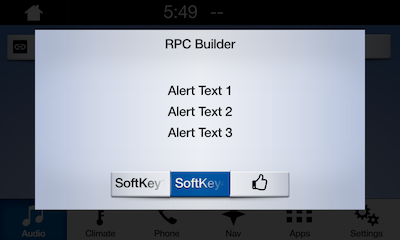

## Alerts

An alert is a pop-up window with some lines of text and optional soft buttons. When an alert is activated, it will abort any SDL operation that is in-progress, except the already-in-progress alert. If an alert is issued while another alert is still in progress, the newest alert will simply be ignored.

### Alert UI
Depending the platform, an alert can have up to three lines of text, a progress indicator (e.g. a spinning wheel or hourglass), and up to four soft buttons.
#### Alert without soft buttons
##### Ford HMI

#### Alert with soft buttons
##### Ford HMI


### Alert TTS
The alert can also be formatted to speak a prompt when the alert appears on the screen. Do this by setting the `ttsChunks` parameter. To play the alert tone before the text-to-speech is spoken, set `playTone` to `true`.

### Example

```java
Alert alert = new Alert();
alert.setAlertText1("Alert Text 1");
alert.setAlertText2("Alert Text 2");
alert.setAlertText3("Alert Text 3");

// Maximum time alert appears before being dismissed
// Timeouts are must be between 3-10 seconds
// Timeouts may not work when soft buttons are also used in the alert
alert.setDuration(5000);

// A progress indicator (e.g. spinning wheel or hourglass)
// Not all head units support the progress indicator
alert.setProgressIndicator(true);

//Text to speech
alert.setTtsChunks(TTS_list); // TTS_list populated elsewhere

// Special tone played before the tts is spoken
alert.setPlayTone(true);

// Soft buttons
alert.setSoftButtons(softButtons); // softButtons populated elsewhere

// Send alert
alert.setCorrelationID(CorrelationIdGenerator.generateId());
proxy.sendRPCRequest(alert);
```

### Dismissing the Alert
The alert will persist on the screen until the timeout has elapsed, or the user dismisses the alert by selecting a button. There is no way to dismiss the alert programmatically other than to set the timeout length.
