## Designing a User Interface

### Designing for Different User Interfaces

Each car manufacturer may have different user interface style guidelines and slight variations in their templates(number of lines of text, buttons, and images supported). After the `SdlManager` has been started and is able to connect to and register on a module, the `SystemCapabilityManager` will have this capability information. The information stored in the `SystemCapabilityManager` can be used to aid in the layout and flow of your user interface.

### Dynamic User Interface Capabilities

After the `SdlManager` has been successfully started the module will have sent any user interface information it has back to your app. This information includes the display type, the type of images supported, the number of text fields supported, the HMI display language, and a lot of other useful properties. This information can be accessed using the `SystemCapabilityManager`. The table below has a list of all possible properties available. Each property is optional, so you may not get information for all the parameters in the table.


| Parameters  |  Description | Notes |
| ------------- | ------------- |------------- |
| sdlLanguage | The currently active voice-recognition and text-to-speech language on the head unit. | Check Language.java for more information |
| hmiDisplayLanguage | The currently active display language on the head unit. | Check Language.java for more information |
| displayCapabilities | Information about the head unit display. This includes information about available templates, whether or not graphics are supported, and a list of all text fields and the max number of characters allowed in each text field. | Check DisplayCapabilities.java for more information |
| buttonCapabilities | A list of available buttons and whether the buttons support long, short and up-down presses. | Check ButtonCapabilities.java for more information |
| softButtonCapabilities | A list of available soft buttons and whether the button support images. Also information about whether the button supports long, short and up-down presses. | Check SoftButtonCapabilities.java for more information |
| presetBankCapabilities | If returned, the platform supports custom on-screen presets. | Check PresetBankCapabilities.java for more information |
| speechCapabilities | Contains information about TTS capabilities on the SDL platform. Platforms may support text, SAPI phonemes, LH PLUS phonemes, pre-recorded speech, and silence. | Check SpeechCapabilities.java for more information |
| prerecordedSpeech | A list of pre-recorded sounds you can use in your app. Sounds may include a help, initial, listen, positive, or a negative jingle. | Check PrerecordedSpeech.java for more information |
| vrCapabilities | The voice-recognition capabilities of the connected SDL platform. The platform may be able to recognize spoken text in the current language. | Check VrCapabilities.java for more information |
| audioPassThruCapabilities | Describes the sampling rate, bits per sample, and audio types available. | Check AudioPassThruCapabilities.java for more information|
| supportedDiagModes | Specifies the white-list of supported diagnostic modes (0x00-0xFF) capable for DiagnosticMessage requests. If a mode outside this list is requested, it will be rejected. | List<Integer> |
| hmiCapabilities | Returns whether or not the app can support built-in navigation and phone calls. | Check HMICapabilities.java for more information |


### Templates

Each car manufacturer supports a set of templates for the user interface. These templates determine the position and size of the text, images, and buttons on the screen. A list of supported templates is sent with `RegisterAppInterface` response and can be accessed using the `SystemCapabilityManager`.  

To change a template at any time, send a `SetDisplayLayout` RPC to the SDL Core. If you want to ensure that the new template is used, wait for a response from the SDL Core before sending any more user interface RPCs.


```java
SetDisplayLayout setDisplayLayoutRequest = new SetDisplayLayout();
setDisplayLayoutRequest.setDisplayLayout(PredefinedLayout.GRAPHIC_WITH_TEXT.toString());
setDisplayLayoutRequest.setOnRPCResponseListener(new OnRPCResponseListener() {
    @Override
    public void onResponse(int correlationId, RPCResponse response) {
        if(((SetDisplayLayoutResponse) response).getSuccess()){
            Log.i("SdlService", "Display layout set successfully.");
            // Proceed with more user interface RPCs
        }else{
            Log.i("SdlService", "Display layout request rejected.");
        }
    }
});

sdlManager.sendRPC(setDisplayLayoutRequest);

```

### Available Templates

There are fifteen standard templates to choose from, however some head units may only support a subset of these templates. Please check the `DisplayCapabilities` object returned by `SystemCapabilityManager` for the supported templates. The following examples show how templates will appear on the generic head unit.

!!! NOTE
You will automatically be assigned the media template if you set your configuration app type as `MEDIA`.
!!!

#### 1. MEDIA - with and without progress bar
##### Ford HMI
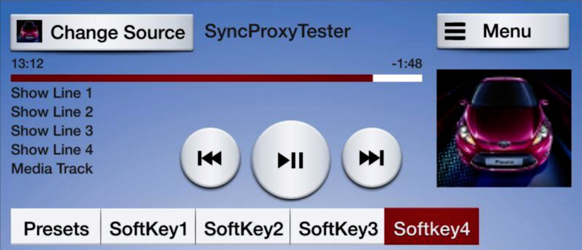

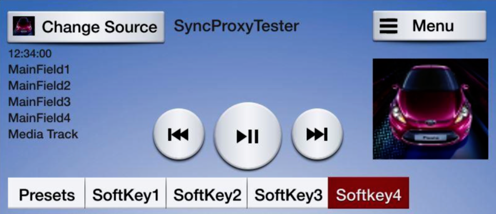
#### 2. NON-MEDIA - with and without soft buttons
##### Ford HMI
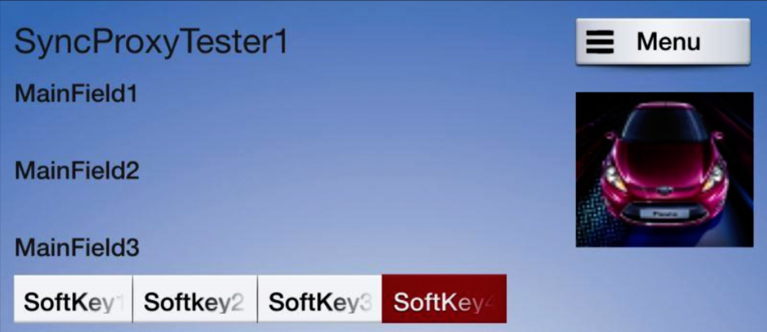

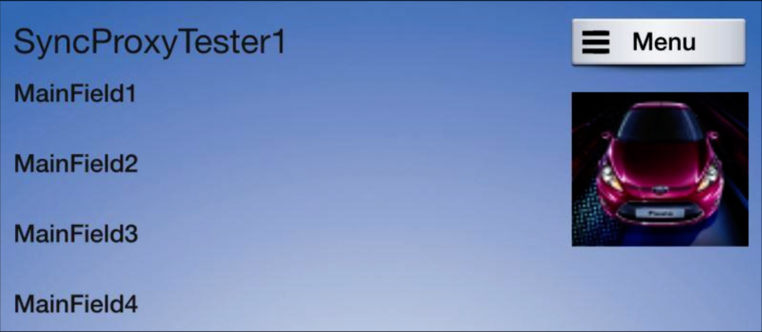
#### 3. GRAPHIC_WITH_TEXT
##### Ford HMI
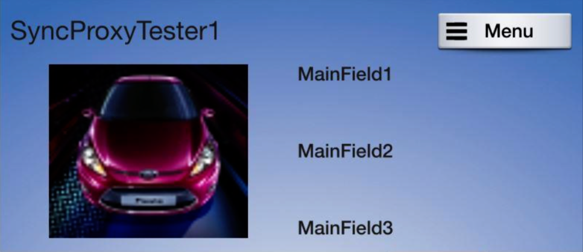
#### 4. TEXT_WITH_GRAPHIC
##### Ford HMI
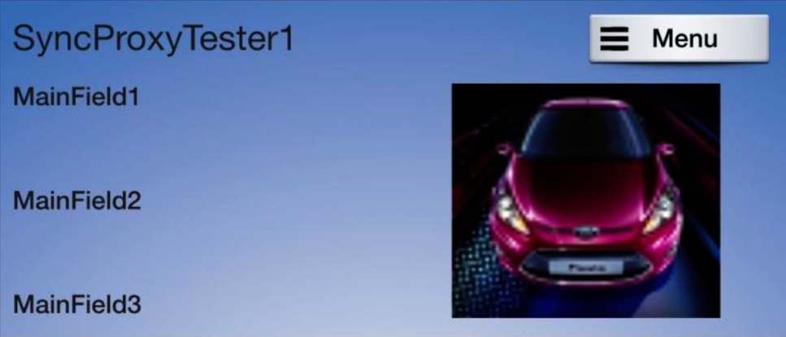
#### 5. TILES_ONLY
##### Ford HMI
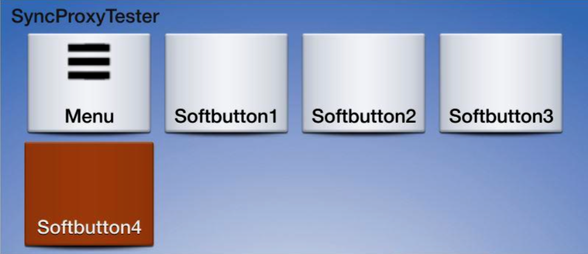
#### 6. GRAPHIC_WITH_TILES
##### Ford HMI
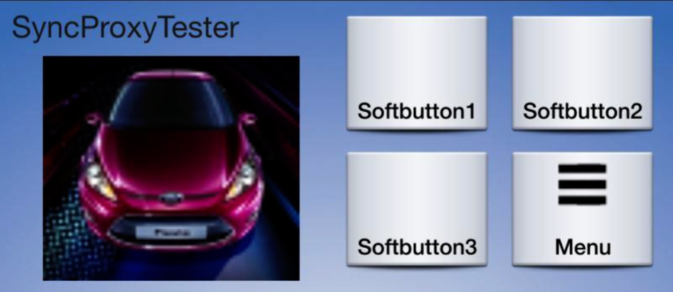
#### 7. TILES_WITH_GRAPHIC
##### Ford HMI
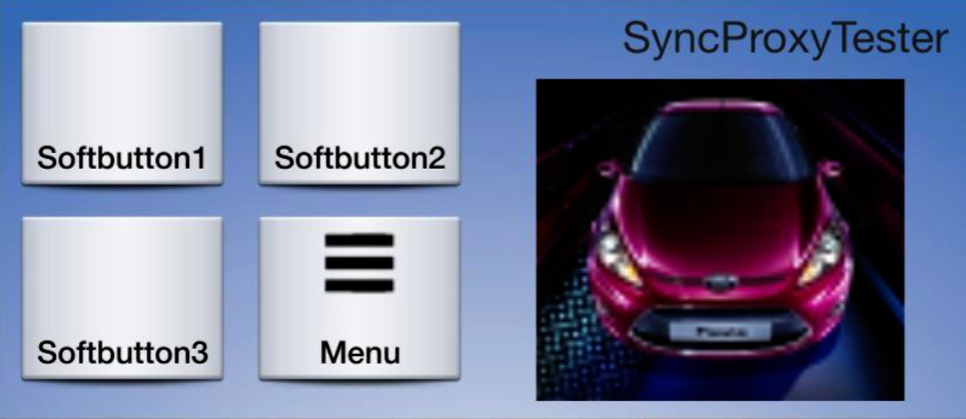
#### 8. GRAPHIC_WITH_TEXT_AND_SOFTBUTTONS
##### Ford HMI
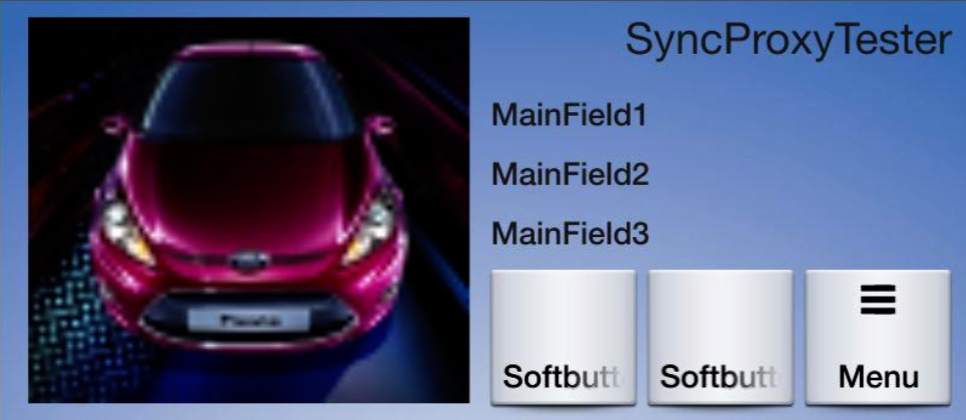
#### 9. TEXT_AND_SOFTBUTTONS_WITH_GRAPHIC
##### Ford HMI
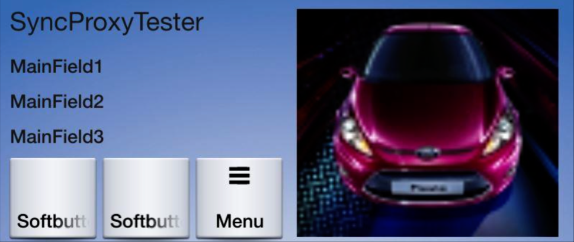
#### 10. GRAPHIC_WITH_TEXTBUTTONS
##### Ford HMI
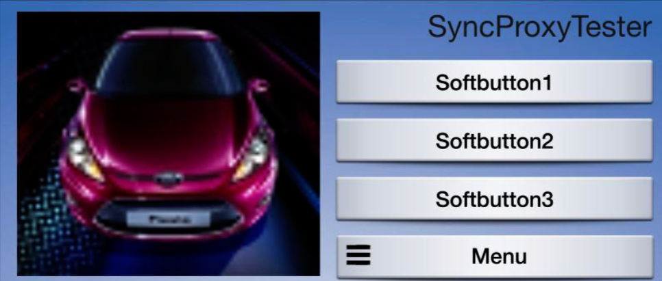
#### 11. DOUBLE_GRAPHIC_SOFTBUTTONS
##### Ford HMI
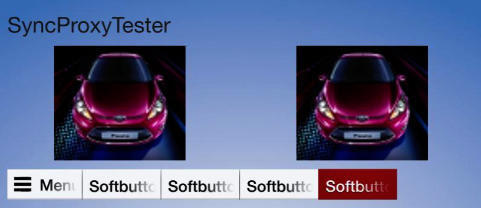
#### 12. TEXTBUTTONS_WITH_GRAPHIC
##### Ford HMI
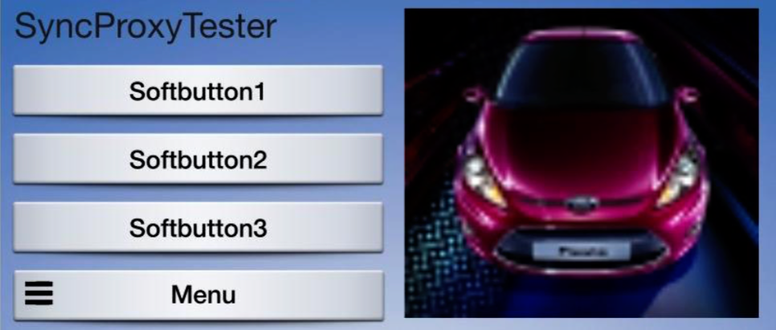
#### 13. TEXTBUTTONS_ONLY
##### Ford HMI
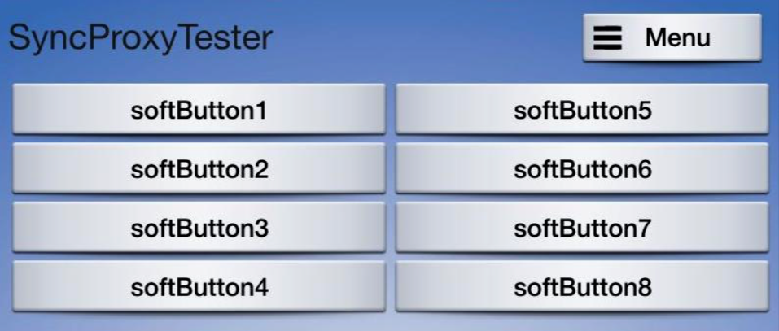
#### 14. LARGE_GRAPHIC_WITH_SOFTBUTTONS
##### Ford HMI

#### 15. LARGE_GRAPHIC_ONLY
##### Ford HMI

