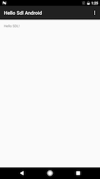
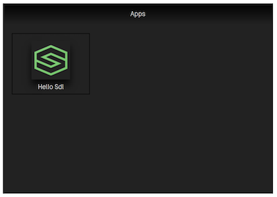
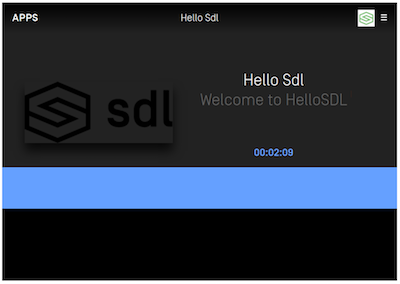
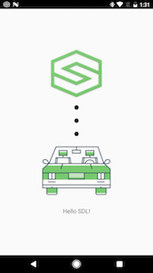

## Hello SDL Android

### Introduction

In this guide we take you through the steps to get our sample project, Hello Sdl Android, running and connected to Sdl Core as well as showing up on the generic HMI. 

First, make sure you download or clone the latest release from [GitHub](https://github.com/smartdevicelink/hello_sdl_android).

Open the project in [Android Studio](https://developer.android.com/studio/index.html). We will exclusively use Android Studio as it is the current supported platform for Android development. 

!!! Note 
The SDL Android Library is packaged with the Hello Sdl Android Project - you will not need to import it
!!!

### Getting Started

If you are not using a Ford TDK for development, we will assume that you have [SDL Core](https://github.com/smartdevicelink/sdl_core) (We recommend Ubuntu 14.04) and an [HMI](https://github.com/smartdevicelink/generic_hmi) setup prior to this point. Most people getting started with this tutorial will not have a Ford TDK, so sample outputs will be using Sdl Core and our Generic HMI.

!!! NOTE
Sdl Core and a HMI are needed to run Hello Sdl Android and to ensure that it connects
!!!

#### Build Flavors

Hello Sdl Android has been built with different **build flavors** that allow you to test different configurations of the application without modifying much, if any, code. 

To access the Build Variant menu in Android Studio, click on the menu ```Build``` then ```Select Build Variant```. A small window will appear on the bottom left of your IDE window that allows you to choose a flavor. 

There are many flavors to choose from and for now we will only be concerned with the debug versions. 

Versions Include:

* lbt - Legacy Bluetooth
* mbt - Multiplexing Bluetooth
* tcp - Transmission Control Protocol
* usb - Universal Serial Bus

We will mainly be dealing with mbt (if using a TDK) or tcp (if connecting to SDL Core via a virtual machine or your localhost)

### Configuring for TCP

Since we most likely will not have a TDK, we will want to connect to SDL core via a virtual machine or to your localhost. To do this we will use the flavor ```tcpDebug```. 

For TCP to work, you will have to know the IP address of your machine that is running Sdl Core. If you don't know what it is, running ```ifconfig``` in a linux terminal will usually let you see it for the interface you are connected with to your network. We have to modify the IP address in Hello Sdl Android to let it know where your instance of Sdl Core is running. 

In the main Java folder of Hello Sdl Android, open up ```SdlService.java```

In the top of this file, locate the variable declaration for ```DEV_MACHINE_IP_ADDRESS```. Change it to your Sdl Core's IP. Leave the ```TCP_PORT``` set to ```12345```.

```java
	// TCP/IP transport config
	private static final int TCP_PORT = 12345;
	private static final String DEV_MACHINE_IP_ADDRESS = "192.168.1.78"; // change to your IP
```

!!! NOTE
if you do not change the target IP address, the application will not connect to Sdl Core or show up on the HMI
!!!

### Configure for Bluetooth

Right out of the box, all you need to do to run bluetooth is to select the ```mbt_offDebug``` (Multiplexing Bluetooth) build flavor. 

### Building the Project.

For TCP, you may use the built-in Android emulator or an Android phone on the same network as Sdl Core. For Bluetooth, you will need an Android phone that is paired to a TDK or head unit via Bluetooth.

!!! MUST
Make sure Sdl Core and the HMI are running prior to running Hello Sdl Android
!!!

Run the project in Android Studio, targeting the device you want Hello Sdl Android installed on. 

Hello Sdl Android should compile and launch on your device of choosing:



Following this, you should see an application appear on the TDK or HMI. In the case of the Generic HMI (using TCP), you will see the following: 



Click on the Hello Sdl icon in the HMI. 



This is the main screen of the Hello Sdl App. If you get to this point, the project is working.

On the device you are running the app on, a lock screen should now appear once the app is opened on the HMI:



!!! NOTE
Lock Screens are an important part of Sdl enabled applications. The goal is to keep the driver's eyes forward and off of the device
!!!

At this point Hello Sdl Android has been compiled and is running properly! Continue reading through our guides to learn about all of the 
RPCs (Remote Procedure Calls) that can be made with the library. 

### Troubleshooting

Sometimes things don't always go as planned, and so this section exists. If your app compiles and does NOT show up on the HMI, there are a few things to check out.

#### TCP

1. Make sure that you have changed the IP in ```SdlService.java``` to match the machine running Sdl Core. Being on the same network is also important.
2. If you are sure that the IP is correct and it is still not showing up, make sure the Build Flavor that is running is ```tcpDebug```.
3. If the two above dont work, make sure there is no firewall blocking the incoming port ```12345``` on the machine or VM running SDL Core. In the same breath, make sure your firewall allows that outgoing port. 

#### Bluetooth

1. Make sure the build flavor ```mbt_offDebug``` is selected. 
2. Ensure your phone is properly paired with the TDK
3. Make sure Bluetooth is turned on - on Both the TDK and your phone
4. Make sure apps are enabled on the TDK (in settings)


 